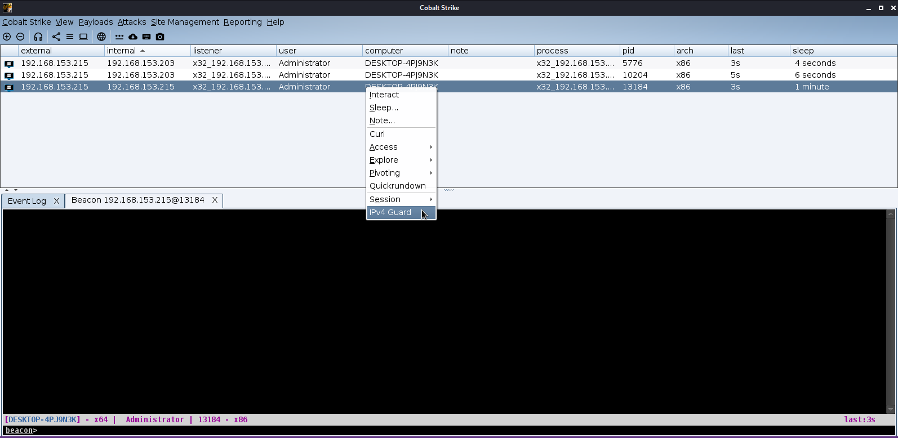
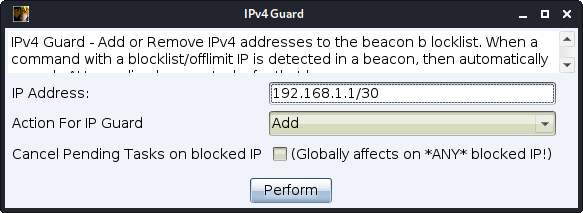
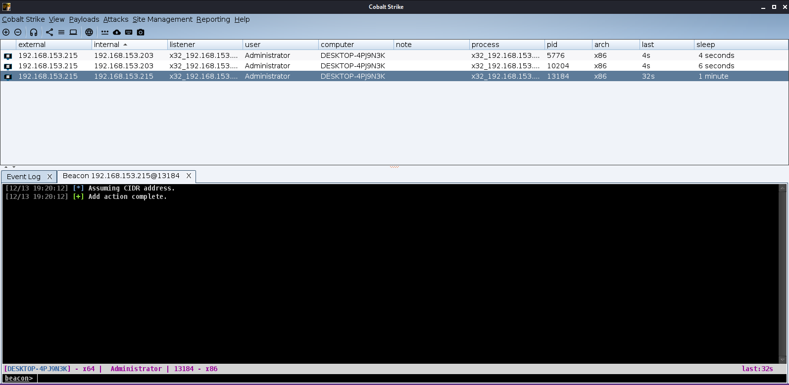
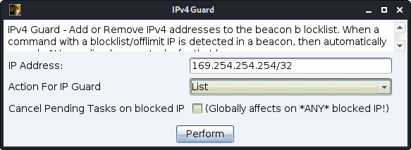
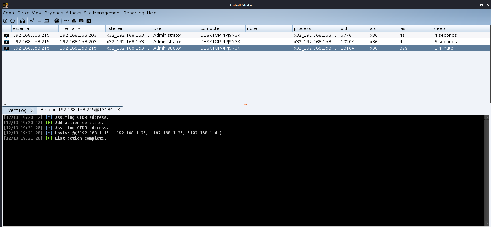
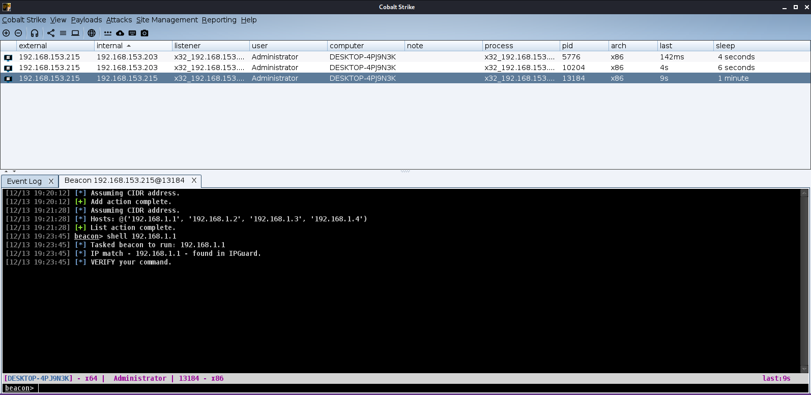

# ipv4guard

A Cobalt Strike Aggressor Script that attempts to prevent Cobalt Strike commands from being executed on non-whitelisted/off-target/unapproved IPv4 addresses.

# Usage

**Right-Click Beacon in Session Window -> Select "IPv4 Guard".**

**Input CIDR IP (like 192.168.1.1/30). Select "Add" as the action. Click Perform.**  

  
[10/19 11:43:47] [*] Assuming CIDR address.  
[10/19 11:41:41] [+] Add action complete.  

**Right-Click Beacon in Session Window -> Select "IPv4 Guard".** 

**Select "List" as the action. IP is ignored. Click Perform.**  

  
[10/19 11:43:47] [*] Assuming CIDR address.  
[10/19 11:43:47] [*] Hosts: @('192.168.1.1', '192.168.1.2', '192.168.1.3', '192.168.1.4')  
[10/19 11:43:47] [+] List action complete.  

**Enter into the Beacon Console a command with the off-limit IP.**

[10/19 11:45:16] [*] Tasked beacon to run: 192.168.1.1  
[10/19 11:45:16] [*]  Line -> shell 192.168.1.1  
[10/19 11:45:16] [*] IP match - 192.168.1.13 - found in IPGuard.  
[10/19 11:45:16] [*] Verify your entered command.  

---

Additional helper functions inside a beacon window can run and act as shorthand for determining the number of hosts in a CIDR or listing out all IPs in that range

Examples:

**Get number of hosts in a CIDR**

[10/19 11:38:46] beacon> ipv4check 192.168.1.1/24 hostcount  
[10/19 11:38:46] [*] Assuming CIDR address.  
[10/19 11:38:46] [*] Hostcount: 254  

**List hosts**

[10/19 11:39:55] beacon> ipv4check 192.168.1.1/30 hosts  
[10/19 11:39:55] [*] Assuming CIDR address.  
[10/19 11:39:55] [*] Hosts: 192.168.1.1, 192.168.1.2  

---
Caveat:
Higher memory consumption on large CIDR ( aruond /12 or lower) blocks. Thusly not suggested for low memory systems.
